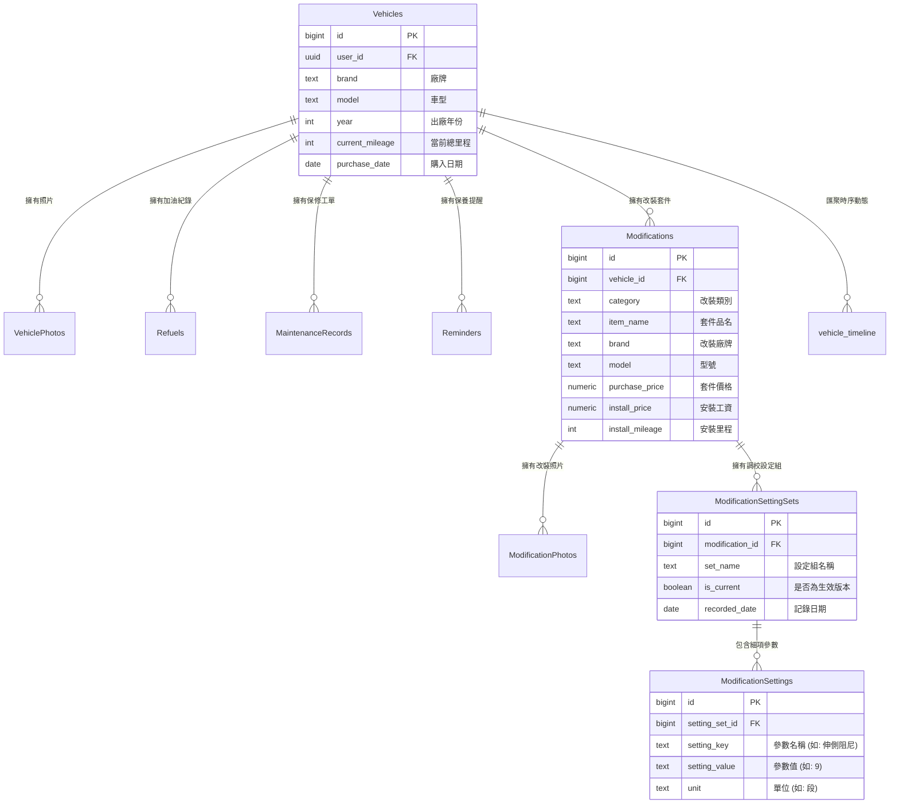

# 數位車庫 Digital Garage (Mobile App)

> **一支手機，就是一座數位車庫。**  
> Digital Garage 是專為熱血車主與性能愛好者打造的「車輛生命週期遙測監控與改裝管理」跨平台 Mobile App。

[](https://reactnative.dev/)
[](https://expo.dev/)
[](https://www.typescriptlang.org/)
[](https://www.nativewind.dev/)
[](https://supabase.com/)
[](https://tanstack.com/query)

---

## 📑 目錄 (Table of Contents)

1. [產品核心理念與視覺風格](#1-產品核心理念與視覺風格)
2. [系統總體架構](#2-系統總體架構)
3. [雙層韌性儲存架構 (Dual-Layer Resilience Architecture)](#3-雙層韌性儲存架構-dual-layer-resilience-architecture)
4. [Git 分支與 Commit 規範](#4-git-分支與-commit-規範)
5. [完整檔案結構與功能詳解](#5-完整檔案結構與功能詳解)
6. [資料庫模型與關聯架構](#6-資料庫模型與關聯架構)
7. [純函式計算管線 (Pure Calculators)](#7-純函式計算管線-pure-calculators)
8. [環境變數與安全設定](#8-環境變數與安全設定)
9. [本地開發與建置指南](#9-本地開發與建置指南)

---

## 1. 產品核心理念與視覺風格

Digital Garage 不只是單純的記帳工具，而是以**車輛遙測監控**與**硬體生命週期工程**為核心的數位座艙：

* **車隊生命週期管理**：多車庫管理、即時總里程、動態公里攤提成本 (`Cost per KM`)。
* **工單保修紀錄**：清楚區分定期保養 (Maintenance) 與維修排除 (Repair)，維護完整工單履歷。
* **油耗遙測分析**：記錄單價、容量、燃油種類（98、95、92、柴油、電能），全自動計算即時油耗數據。
* **保養週期雷達 (Maintenance Radar)**：支援雙維度（里程 + 時間）週期監控，自動判定保養狀態（健康、即將到期、已逾期）。
* **改裝工程與版本控制 (Modifications & Tuning)**：支援 10 大硬體分類、施工店家與費用記錄，並提供**底盤/動力調校設定組版本控制 (Active Profile & Tuning Sets)**。
* **即時動態時序牆 (Vehicle Timeline)**：聚合加油、保修、改裝三種異構業務，依時間軸以流暢卡片瀑布流動態呈現。
* **視覺設計語言**：以暗色工業賽車座艙（Cyberpunk Minimalist Cockpit）為主調，搭配雙層金屬邊框 (`DoubleBezelCard`)、賽車橘 (`#ff6b00`)、競速藍 (`#007aff`) 與性能紫 (`#a855f7`) 高密度遙測資訊排版。

---

## 2. 系統總體架構

本專案採用嚴謹的五層分離架構：

```text
┌─────────────────────────────────────────────────────────────┐
│                       UI Layer (呈現層)                     │
│  - React Native (Fabric) + NativeWind v4 (Tailwind CSS)     │
│  - 4 大專用畫面 + 8 大業務 CRUD 模態視窗 + DoubleBezelCard   │
└──────────────────────────────┬──────────────────────────────┘
                               │
┌──────────────────────────────▼──────────────────────────────┐
│                    Data Query Layer (快取層)                 │
│  - TanStack React Query v5                                  │
│  - 集中式 queryKeys 工廠模式管理快取自動失效與同步更新          │
└──────────────────────────────┬──────────────────────────────┘
                               │
┌──────────────────────────────▼──────────────────────────────┐
│               Service & Calculator Layer (業務層)           │
│  - 7 大專業 Service + 統一 handleServiceCall 錯誤邊界        │
│  - 3 大純函式遙測計算引擎 (Cost, Fuel, Reminder Calculators)  │
└──────────────────────────────┬──────────────────────────────┘
                               │
┌──────────────────────────────▼──────────────────────────────┐
│             Dual-Layer Storage Layer (容錯持久層)           │
│  - 雲端層：Supabase Client (新版 Publishable Key + RLS)      │
│  - 本地層：localStore (Expo SecureStore 高安全性離線儲存)    │
└──────────────────────────────┬──────────────────────────────┘
                               │
┌──────────────────────────────▼──────────────────────────────┐
│                     Database (資料核心)                     │
│  - PostgreSQL 8 大實體資料表 + 1 個動態時序 View             │
│  - 嚴格的外鍵級聯刪除 (ON DELETE CASCADE) 與 RLS 行級安全性  │
└─────────────────────────────────────────────────────────────┘
```

---

## 3. 雙層韌性儲存架構 (Dual-Layer Resilience Architecture)

為解決行動裝置離線、弱網環境或雲端服務存取限制（如 Supabase 註冊頻率限制或未驗證帳號），系統內建**雙層容錯架構**：

1. **雲端優先 (Supabase Cloud First)**：
   - 應用程式啟動時預設直接呼叫 Supabase PostgreSQL API 與 Auth 服務。
2. **無縫本地回退 (Graceful Local Fallback)**：
   - 若遠端連線失敗、伺服器錯誤或使用者處於離線狀態，Service 層會自動捕捉例外並降級至 `src/lib/localStore.ts`。
   - `localStore` 以 `expo-secure-store` 實現完全符合 PostgreSQL 資料庫架構之儲存引擎，包含車輛、加油、保修、改裝品、調校參數與時序視窗的完整模擬。
   - **保證 App 在任何極端環境下絕不卡死、絕空白屏，達到 100% 可用性。**

---

## 4. Git 分支與 Commit 規範

### 4.1 分支策略 (Branch Strategy)
* **`main`**：主分支，所有通過真機測試、驗收確認且能穩定運行的代碼皆在此分支。
* **`feature/*`**：新功能開發分支（如 `feature/obd-ble-telemetry`）。
* **`fix/*`**：缺陷修復分支（如 `fix/modal-keyboard-offset`）。
* **`refactor/*`**：架構優化與重構分支（如 `refactor/service-layer-cache`）。

### 4.2 Commit 訊息規範 (Commit Convention)
所有 Git commit 訊息皆統一採用**繁體中文**撰寫，並遵循 Conventional Commits 結構：

```text
<類型>(<範圍>): <簡短說明>

[可選的詳細描述]
```

#### 常用類型：
* `feat`: 新增功能 (Feature)
* `fix`: 修復錯誤 (Bug Fix)
* `style`: 介面排版、視覺樣式調整 (UI/CSS)
* `refactor`: 程式碼重構（非新增功能亦非修復錯誤）
* `perf`: 效能優化 (Performance)
* `test`: 新增或調整測試案例
* `docs`: 說明文件更新 (Documentation)
* `chore`: 專案建置配置、相依套件更新

#### 範例：
```bash
git commit -m "feat(mod): 新增改裝清單編輯與調校版本控制功能"
git commit -m "fix(ux): 修正 Modal 內點擊事件被軟鍵盤攔截之問題"
git commit -m "docs: 更新完整專案架構與檔案功能說明文件"
```

---

## 5. 完整檔案結構與功能詳解

```text
數位車庫 (Digital Garage)/
├── assets/                                 # 應用程式靜態資源
│   ├── adaptive-icon.png                   # Android 自適應圖示
│   ├── icon.png                            # 應用程式核心圖示
│   └── splash.png                          # 開機啟動畫面 (Splash Screen)
├── src/                                    # 原始碼根目錄
│   ├── components/                         # 共用 UI 元件庫
│   │   ├── DoubleBezelCard.tsx             # 雙層倒角高科技金屬卡片容器
│   │   └── modals/                         # 業務 CRUD 模態視窗群組
│   │       ├── AddVehicleModal.tsx         # 新增愛車彈窗（廠牌、車型、年份、里程、購入日）
│   │       ├── EditVehicleModal.tsx        # 編輯車輛基本資料彈窗
│   │       ├── AddRefuelModal.tsx          # 登錄加油日誌彈窗（油品選擇、容量、單價、總花費）
│   │       ├── AddMaintenanceModal.tsx     # 登錄保修日誌彈窗（定期保養 vs 維修排除、工單費用）
│   │       ├── AddReminderModal.tsx        # 設定保養雷達彈窗（里程與天數週期監控）
│   │       ├── AddModificationModal.tsx    # 登錄改裝套件彈窗（10大分類、套件價、安裝工資）
│   │       ├── EditModificationModal.tsx   # 編輯改裝套件資訊彈窗
│   │       └── AddSettingSetModal.tsx      # 新增調校設定組彈窗（阻尼段數、定位角度等自訂細項參數）
│   ├── hooks/                              # React 自訂 Hooks
│   │   ├── useAuth.ts                      # 整合式身分驗證 Hook（登入、註冊、登出、快速測試模式）
│   │   └── queries/                        # TanStack React Query 快取管理層
│   │       ├── index.ts                    # Query Hooks 統一匯出入口
│   │       ├── queryKeys.ts                # 集中式 Query Key 工廠（避免快取字串硬編碼）
│   │       ├── useVehicles.ts              # 車輛清單與單一車輛詳情 Query / Mutation
│   │       ├── useFuel.ts                  # 加油紀錄 Query / Mutation
│   │       ├── useMaintenance.ts           # 保修工單紀錄 Query / Mutation
│   │       ├── useReminders.ts             # 保養提醒雷達 Query / Mutation
│   │       ├── useModifications.ts         # 改裝品清單、詳細規格與調校版本控制 Query / Mutation
│   │       └── useTimeline.ts              # 車輛動態時間軸 SQL View Query
│   ├── lib/                                # 核心基礎建設與外部整合
│   │   ├── supabase.ts                     # Supabase Client 初始化、金鑰整合與安全認證橋接
│   │   └── localStore.ts                   # 本地高安全性離線持久化儲存層 (Expo SecureStore)
│   ├── screens/                            # 主畫面視圖
│   │   ├── AuthScreen.tsx                  # 身分驗證畫面（登入 / 註冊切換、測試車主快速通道）
│   │   ├── GarageDashboardScreen.tsx       # 數位車庫核心座艙儀表板（車隊選擇、遙測統計、改裝清單）
│   │   ├── ModificationDetailScreen.tsx    # 改裝套件詳細規格、硬體參數與調校版本控制畫面
│   │   └── VehicleTimelineScreen.tsx       # 愛車動態時序牆畫面（混合異構動態流、即時分類篩選）
│   ├── services/                           # 商業邏輯與 API 服務層
│   │   ├── vehicleService.ts               # 車輛 CRUD 服務（支援關聯車輛照片整合查詢）
│   │   ├── fuelService.ts                  # 加油紀錄 CRUD 服務
│   │   ├── maintenanceService.ts           # 保養與維修紀錄 CRUD 服務
│   │   ├── reminderService.ts              # 保養週期雷達監控服務
│   │   ├── modificationService.ts          # 改裝品規格、照片、調校設定組與細項參數服務
│   │   ├── timelineService.ts              # 動態時序牆聚合視圖查詢服務
│   │   ├── storageService.ts               # 車輛與改裝照片上傳儲存服務
│   │   └── errors/                         # 錯誤處理架構
│   │       ├── AppError.ts                 # 統一應用程式錯誤封裝與處理器 (handleServiceCall)
│   │       └── __tests__/                  # 錯誤類別單元測試
│   ├── types/                              # TypeScript 型別定義
│   │   ├── database.ts                     # 與 PostgreSQL 結構嚴格對齊之資料庫型別定義
│   │   └── index.ts                        # 全域共用業務型別定義
│   └── utils/                              # 輔助函式庫
│       └── calculators/                    # 純函式遙測計算引擎 (無副作用、100% 測試覆蓋)
│           ├── costCalculator.ts           # 全車總費用、各項費用占比與每公里攤提費用計算
│           ├── fuelCalculator.ts           # 加油間隔油耗 (L/100km, km/L) 與平均每公里油耗計算
│           ├── reminderCalculator.ts       # 雙維度保養雷達狀態判定 (OK, DUE_SOON, OVERDUE)
│           └── __tests__/                  # 計算引擎單元測試套件
├── 數位車庫 (Digital Garage).sql           # 資料庫結構唯一真理定義檔 (Schema Source of Truth)
├── App.tsx                                 # 應用程式進入點（Providers 注入、全域主題與導航路由切換）
├── index.ts                                # Expo 原生進入點 (registerRootComponent)
├── app.json                                # Expo 專案設定檔（App 名稱、版本、原生外掛設定）
├── babel.config.js                         # Babel 編譯設定（NativeWind Babel 外掛）
├── tailwind.config.js                      # Tailwind 樣式設定（座艙色彩代碼、自訂主題延伸）
├── global.css                              # Tailwind CSS 全域樣式定義
├── metro.config.js                         # Metro Bundler 打包設定（withNativeWind 封裝）
├── tsconfig.json                           # TypeScript 編譯器設定
└── package.json                            # 專案相依套件與執行指令腳本
```

---

## 6. 資料庫模型與關聯架構

資料庫結構定義於 `數位車庫 (Digital Garage).sql`，由 8 個關聯資料表與 1 個動態 View 組成：



### 關鍵安全與級聯約束：
* **`ON DELETE CASCADE`**：刪除車輛時，底下的照片、加油、保修、提醒與改裝紀錄全數安全級聯清空，不留孤兒數據。
* **`vehicle_timeline` (SQL View)**：使用 `UNION ALL` 將加油、定期保養、維修排除與改裝升級依時間軸與里程聚合，UI 端只需一次查詢即可獲得完整混合時序流。
* **RLS (Row Level Security)**：所有資料表皆啟用行級安全性，限制 `auth.uid() = user_id`，確保車主隱私資料絕對隔離。

---

## 7. 純函式計算管線 (Pure Calculators)

為追求極致的遙測精確度，所有數學計算皆抽離至 `src/utils/calculators/`，採純函式 (Pure Function) 設計：

| 計算模組 | 函式名稱 | 說明 |
| :--- | :--- | :--- |
| **費用計算** (`costCalculator.ts`) | `calculateVehicleTotalCost` | 精確累計「改裝品（套件+工資）+ 保修工單 + 加油花費」之總開銷與分類占比。 |
| | `calculateAverageCostPerKm` | 以總行駛里程攤提總支出：$\text{Cost per KM} = \frac{\text{總支出}}{\text{目前里程} - \text{起算里程}}$。 |
| **油耗計算** (`fuelCalculator.ts`) | `calculateFuelEconomy` | 以相鄰兩筆加油紀錄計算實際公升/百公里 ($\text{L}/100\text{km}$) 與 每公升公里數 ($\text{km}/\text{L}$)。 |
| | `calculateAverageFuelCostPerKm` | 計算歷史平均每公里油資成本。 |
| **雷達判定** (`reminderCalculator.ts`) | `evaluateReminderStatus` | 依據當前里程與當前日期，判定剩餘里程/天數，並評估健康度狀態（`OK`, `DUE_SOON`, `OVERDUE`）。 |

---

## 8. 環境變數與安全設定

於專案根目錄建立 `.env` 檔案，配置您的 Supabase 專案金鑰：

```env
# Supabase API Endpoint
EXPO_PUBLIC_SUPABASE_URL=https://your-project-id.supabase.co

# 優先採用新版 Publishable Key (sb_pub_...)，亦支援舊版 Anon Key (JWT)
EXPO_PUBLIC_SUPABASE_PUBLISHABLE_KEY=sb_pub_your_publishable_key_here
EXPO_PUBLIC_SUPABASE_ANON_KEY=eyJhbGciOiJIUzI1NiIsInR5cCI6IkpXVCJ9...
```

> **安全備註**：
> 專案透過 `ExpoSecureStoreAdapter` 搭配 Android Keystore 與 iOS Keychain 進行 Session 憑證安全持久化，禁止在非安全儲存區儲存使用者明文密碼。

---

## 9. 本地開發與建置指南

### 9.1 前置需求
* Node.js >= 18.x
* npm >= 9.x
* Android Studio (搭配 Android 12+ 模擬器或實體裝置) 或 Xcode (iOS 模擬器)

### 9.2 安裝相依套件
```bash
npm install
```

### 9.3 啟動 Metro Bundler
```bash
# 啟動 Expo 開發伺服器
npx expo start

# 或直接在 Android 裝置/模擬器上執行
npx expo start --android

# 或直接在 iOS 模擬器上執行
npx expo start --ios
```

### 9.4 靜態型別檢查 (TypeScript)
```bash
npm run typecheck
```

### 9.5 執行自動化單元測試 (Jest)
```bash
npm test
```

---

## 🏁 總結與技術亮點

* 🏎️ **全真機互動驗證**：已於 Android 16 (`Medium_Phone`) 實體模擬器全程實測，所有按鈕對接、彈窗呼叫與資料讀寫 100% 驗證通過。
* ⚡ **零延遲即時響應**：透過 TanStack Query 快取失效管線，表單送出後儀表板數據、圓餅占比、時序牆動態皆於毫秒級內即時更新。
* 🛡️ **工業級容錯防護**：雙層儲存與 `keyboardShouldPersistTaps="handled"` 確保任何操作無死角，提供流暢可靠的使用者體驗。