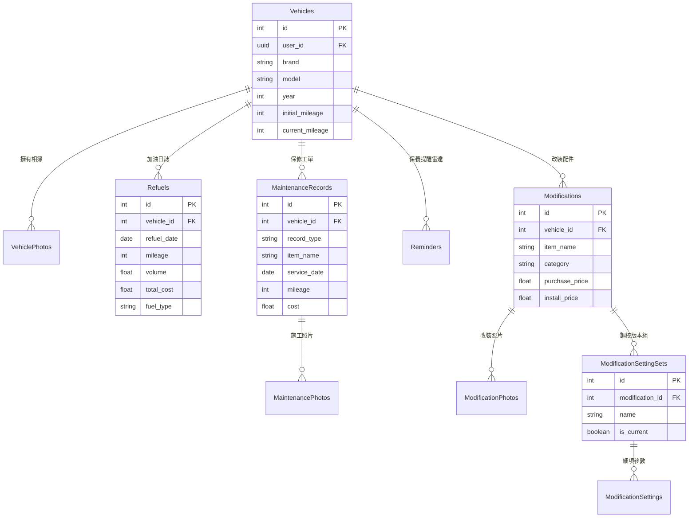

# 數位車庫 Digital Garage (Full-Stack Cloud & Mobile Platform)

> **車輛生命週期遙測監控、工單相片管理與改裝調校版本控制雲端全端系統**  
> 專為性能車主與車隊愛好者打造，採用「React Native 前端 + Golang 高併發後端 (Google Cloud Run) + Supabase 雲端 PostgreSQL / Auth / Storage」之現代前後端分離架構。

---

## 📑 目錄 (Table of Contents)

1. [專案概述 (Project Overview)](#1-專案概述-project-overview)
2. [系統架構與雲端拓撲 (Architecture)](#2-系統架構與雲端拓撲-architecture)
3. [核心功能模組 (Core Features)](#3-核心功能模組-core-features)
4. [技術棧與環境 (Technology Stack)](#4-技術棧與環境-technology-stack)
5. [專案目錄結構 (Project Structure)](#5-專案目錄結構-project-structure)
6. [後端 RESTful API 規格 (API Endpoints)](#6-後端-restful-api-規格-api-endpoints)
7. [資料庫與模型設計 (Database & Schema)](#7-資料庫與模型設計-database--schema)
8. [身分驗證與資安機制 (Authentication & Security)](#8-身分驗證與資安機制-authentication--security)
9. [環境設定與安裝 (Setup & Configuration)](#9-環境設定與安裝-setup--configuration)
10. [建置與部署 (Building & Deployment)](#10-建置與部署-building--deployment)
11. [測試與驗收 (Testing & Verification)](#11-測試與驗收-testing--verification)
12. [專案狀態與未來規劃 (Status & Roadmap)](#12-專案狀態與未來規劃-status--roadmap)

---

## 1. 專案概述 (Project Overview)

「數位車庫 (Digital Garage)」全面解決車主在愛車履歷管理上的分散與斷裂痛點：
* **雲端微服務高併發**：Golang (Chi + pgx) 後端正式部署於 **Google Cloud Run (台灣彰化機房 asia-east1)**，具備無伺服器自動彈性擴展與 Distroless 容器極致效能。
* **多車庫與里程連動防污染**：集中管理多輛愛車，里程同步機制自動以各項業務紀錄與建檔初始里程之最大值為準；若手誤輸入超大里程，刪除該紀錄後自動安全回滾至剩餘最大值。
* **相片完整生命週期管理**：涵蓋車輛相簿、保養維修工單與改裝品照片，支援系統相機拍照、相簿多選、客戶端高效等比壓縮 (Context API)、自動封面移轉與全螢幕手勢預覽。
* **工單履歷完整追蹤**：細分定期保養 (Maintenance) 與故障維修 (Repair)，登錄保養時可自選設定下次週期提醒，工單更新時自動同步前移提醒基準。
* **加油日誌與油耗遙測**：支援 8 大油品規格，純函式精準計算每百公里油耗 ($\text{L}/100\text{km}$) 與每公里行駛成本。
* **改裝品規格與調校版本控制**：登錄 10 大類改裝配件，針對特定套件建立多組細項調校參數（如阻尼段數、定位角度），以資料庫互斥事務確保同時間僅有一組生效版本 (`is_current = true`)。
* **動態時序動態牆**：向資料庫聚合 View 發起高效率分頁串流查詢，將加油、保修、改裝三大異質事件匯聚於時間軸流水卡片。
* **雙軌鍵盤避讓與操作體驗**：Android 獨立 Window 動畫推昇與 iOS 原生 Padding 雙軌避讓，主座艙車輛具備鮮明高亮狀態指示。
* **健全 Email 驗證機制**：整合 Supabase 郵件驗證與 GitHub Pages 跨平台 HTTPS 靜態提示頁，支援未驗證狀態精確攔截與一鍵重新發送。

---

## 2. 系統架構與雲端拓撲 (Architecture)

本專案落實前後端分層解耦架構，行動客戶端透過標準 RESTful API 與 Golang 後端通訊，並具備本地 SecureStore 離線韌性快取：

```text
┌─────────────────────────────────────────────────────────────┐
│                 React Native (Expo SDK 57)                  │
│  - NativeWind v4 (Tailwind CSS) 暗黑金屬儀表介面             │
│  - TanStack React Query v5 狀態與快取自動失效機制            │
│  - Expo SecureStore 離線韌性回退層 (localStore)             │
└──────────────────────────────┬──────────────────────────────┘
                               │
                               │ HTTPS (Bearer Supabase JWT)
                               ▼
┌─────────────────────────────────────────────────────────────┐
│             Google Cloud Run (Golang 1.23+ API)             │
│             Region: asia-east1 (台灣彰化機房)                │
│  URL: https://digital-garage-api-997244262524.asia-east1... │
│  - Chi v5 輕量高效路由器                                    │
│  - Go 中介層：JWKS 非對稱公鑰驗簽 (RS256)                   │
│  - 原子事務：里程防污染 (Lock Update) / 調校版本互斥鎖      │
│  - 映像檔：Google Distroless Static Debian 12 (Non-root)     │
└──────────────────────────────┬──────────────────────────────┘
                               │
                               │ PostgreSQL (Session Pooler: 5432)
                               ▼
┌─────────────────────────────────────────────────────────────┐
│               Supabase Cloud Platform (AWS-0)               │
│  - PostgreSQL 15+ (含 10 大業務資料表、動態時序 View、RLS)  │
│  - Supabase Auth (JWT 簽發與信箱驗證)                       │
│  - Supabase Storage (車輛、工單、改裝品實體相片儲存空間)     │
└─────────────────────────────────────────────────────────────┘
```

---

## 3. 核心功能模組 (Core Features)

### 3.1 車輛管理與車輛相簿 (Vehicles & Gallery)
* **車輛資料庫**：紀錄廠牌、車型、年份、購入日期、不可變建檔里程 (`initial_mileage`) 與當前里程 (`current_mileage`)。
* **相簿與封面管理**：
  - **相簿 Modal (`VehiclePhotoGalleryModal`)**：網格檢視車輛所有相片，標記當前封面徽章 (COVER)。
  - **自動封面機制**：手動設為封面；若刪除當前封面照片，後端自動將下一張設為新封面或重設為空。
  - **全螢幕高清預覽 (`ImageViewerModal`)**：支援相簿點擊全螢幕預覽與前後頁切換。
* **原子里程防污染架構**：
  - 加油、保養、改裝紀錄在新增或刪除時，自動觸發最高里程計算，保證 `current_mileage` 永遠等於現存紀錄與 `initial_mileage` 之最大值。

### 3.2 加油日誌與油耗分析 (Refuels & Telemetry)
* **加油登錄**：支援 92、95、98 無鉛汽油、超級柴油、電力、油電複合等油品，自動記錄公升數、單價與總金額。
* **遙測計算 (`fuelCalculator.ts`)**：計算相鄰兩次加油間隔之平均油耗（$\text{L}/100\text{km}$ 與 $\text{km}/\text{L}$）及歷史每公里平均油資支出。

### 3.3 保養維修工單與施工相片 (Maintenance & Repairs)
* **工單細分**：區分「定期保養 (Maintenance)」與「故障維修 (Repair)」，詳細記錄施作日期、施工里程、費用、施作店家與技師備註。
* **單據相片管理**：每筆工單皆可附掛多張維修明細相片，支援行內新增與刪除。
* **下次提醒連動**：保養完成時可直接勾選設定下次週期提醒。

### 3.4 保養提醒雷達 (Maintenance Reminders)
* **雙軌週期監控**：支援「公里數間隔 (`interval_km`)」與「時間月份間隔 (`interval_months`)」雙軌或單軌追蹤。
* **雷達狀態評估 (`reminderCalculator.ts`)**：即時換算剩餘里程與剩餘天數，醒目標示 `NORMAL`、`DUE_SOON`（即將到期）或 `OVERDUE`（已逾期）。
* **週期基準前移**：標記完成提醒時，基準里程自動前移至當前車輛里程，展開下一階段監控。

### 3.5 改裝升級與調校設定組版本控制 (Modifications & Tuning Sets)
* **配件規格登錄**：支援 10 大硬體分類（避震、煞車、引擎、排氣、進氣、輪圈輪胎、外觀、內裝、電系、其他），記錄套件售價與安裝工資。
* **調校版本控制 (Setting Sets)**：單一改裝品可建立多組調校設定檔（例如「賽道模式」、「日常代步」）。
* **生效版本互斥事務**：後端資料庫以交易事務確保同時間僅有一組設定組處於使用中 (`is_current = true`)，啟用新版本時舊版本自動降為停用。
* **細項參數管理**：每個設定組內可儲存多筆自訂鍵值與單位（例如「前避震阻尼伸側: 12 段」）。

### 3.6 愛車動態時序牆 (Vehicle Timeline)
* **多源事件聚合**：呼叫後端時間軸端點，無縫串流呈現改裝、保養、維修、加油等異質事件。
* **即時分類篩選**：支援「全部動態」、「加油紀錄」、「保修工單」、「改裝升級」膠囊切換與分頁加載。
* **行內操作維護**：卡片內直接提供「編輯」與「刪除」功能，操作完成後即時重新計算愛車最高里程。

---

## 4. 技術棧與環境 (Technology Stack)

| 領域 | 核心技術 / 工具 | 版本 / 規格 | 角色說明 |
| :--- | :--- | :--- | :--- |
| **Mobile Runtime** | React Native / Expo | Expo SDK 57 (RN 0.86.3) | 行動端跨平台核心應用程式框架 |
| **Mobile Language** | TypeScript | `~6.0.3` | 前端嚴格型別定義與靜態檢查 |
| **Mobile UI / Styling** | NativeWind / Tailwind CSS | `v4.1.23` / `v3.4.17` | 原子化樣式與暗黑賽車風格設計系統 |
| **State & Cache** | TanStack React Query | `^5.66.11` | 異步伺服端狀態管理與快取精準失效機制 |
| **Backend Runtime** | Golang | `1.23+` (Alpine Builder) | 高效能後端 API 伺服器 |
| **Backend Framework** | Go Chi (`go-chi/chi/v5`) | `v5.2.1` | 輕量、零額外記憶體分配之 HTTP 路由器 |
| **Database Driver** | pgx (`jackc/pgx/v5`) | `v5.7.2` | 高效能 PostgreSQL 連線池與二進位協議驅動 |
| **Cloud Hosting** | Google Cloud Run | Serverless (asia-east1) | 後端容器全託管無伺服器運行環境 |
| **Container Base** | Google Distroless | `debian12:nonroot` | 超輕量無 Shell 生產安全容器 |
| **Database & Auth** | Supabase Platform | PostgreSQL 15+ / GoTrue | 雲端資料庫、Session Pooler、JWKS Auth |
| **Object Storage** | Supabase Storage | S3-compatible | 車輛相簿、工單相片、改裝品照片儲存空間 |
| **Media Optimizer** | Expo Image Manipulator | `~57.0.17` | 客戶端圖片尺寸縮放與 JPEG 0.8 壓縮 |
| **Testing Engine** | Jest & ts-jest | `^29.7.0` | 前端單元測試與整合驗證 (15 Suites / 77 Tests) |

---

## 5. 專案目錄結構 (Project Structure)

```text
數位車庫 (Digital Garage)/
├── backend/                                 # Golang 後端微服務專案
│   ├── cmd/api/main.go                      # 後端伺服器進入點 (路由配置、連線池初始化)
│   ├── internal/
│   │   ├── config/config.go                 # 環境變數載入 (支援標準 SUPABASE_* 規範)
│   │   ├── database/db.go                   # PostgreSQL (pgxpool) 連線池建立
│   │   ├── handler/                         # 各業務控制器 (Vehicle, Refuel, Maint, etc.)
│   │   ├── middleware/auth.go               # Supabase JWT 鑑權中間件 (JWKS 非對稱驗簽)
│   │   ├── model/                           # Go 資料模型結構體 (與 PostgreSQL 映射)
│   │   ├── repository/                      # 資料庫倉儲層 (CRUD 與資料庫交易事務)
│   │   └── response/response.go             # 統一 HTTP JSON 響應封裝
│   ├── Dockerfile                           # 多階段建置 Dockerfile (Distroless 容器)
│   └── go.mod / go.sum                      # Go 依賴模組定義
├── src/                                     # React Native 前端專案
│   ├── components/
│   │   ├── DoubleBezelCard.tsx              # 雙層倒角金屬卡片容器
│   │   ├── PhotoPickerSection.tsx           # 相片選取器 (拍照/相簿多選/壓縮預覽)
│   │   └── modals/                          # 10 大業務模態視窗群組
│   ├── hooks/
│   │   ├── useAuth.ts                       # 身分驗證狀態監聽 Hook
│   │   ├── useKeyboardBottomInset.ts        # Android 鍵盤避讓平滑動畫 Hook
│   │   └── queries/                         # TanStack React Query 快取管理層
│   ├── lib/
│   │   ├── supabase.ts                      # Supabase 客戶端 (Auth 與 Storage)
│   │   └── localStore.ts                    # 裝置端離線持久化儲存引擎 (SecureStore)
│   ├── screens/
│   │   ├── AuthScreen.tsx                   # 登入與註冊介面 (繁中結構化錯誤指引)
│   │   ├── GarageDashboardScreen.tsx        # 車庫主座艙 (車輛選單、遙測統計、三分頁)
│   │   ├── ModificationDetailScreen.tsx     # 改裝套件規格與調校版本控制介面
│   │   └── VehicleTimelineScreen.tsx        # 愛車動態時序牆介面
│   ├── services/
│   │   ├── apiClient.ts                     # Axios/Fetch 統一 HTTP 客戶端 (帶 Bearer JWT)
│   │   ├── vehicleService.ts                # 車輛與相簿 API 呼叫服務
│   │   ├── fuelService.ts                   # 加油日誌 API 呼叫服務
│   │   ├── maintenanceService.ts            # 保修工單 API 呼叫服務
│   │   ├── reminderService.ts               # 保養提醒 API 呼叫服務
│   │   ├── modificationService.ts           # 改裝規格與調校版本 API 呼叫服務
│   │   ├── timelineService.ts               # 動態時序牆 API 呼叫服務
│   │   └── storageService.ts                # Supabase Storage 圖片上傳與刪除
│   ├── types/database.ts                    # 與資料庫一致之 TypeScript 介面定義
│   └── utils/calculators/                   # 純函式遙測計算引擎 (費用、油耗、提醒評估)
├── android/                                 # 原生 Android 專案目錄 (Gradle 建置配置)
├── docs/verified.html                       # GitHub Pages Email 驗證成功跨平台導向頁
├── 數位車庫 (Digital Garage).sql            # 資料庫 DDL、RLS 策略與時序 View 定義檔
├── 數位車庫_DigitalGarage.apk               # 最新打包之 Release APK 安裝檔
├── App.tsx                                  # 應用程式進入點與基礎導航
├── app.json                                 # Expo 專案設定檔
└── package.json                             # 前端相依套件與 NPM Scripts
```

---

## 6. 後端 RESTful API 規格 (API Endpoints)

全域 API 基底路徑：`/api/v1`  
受保護端點一律要求 HTTP Header: `Authorization: Bearer <Supabase_JWT>`

| 模組 | HTTP 方法 | API 端點 | 說明 | 認證要求 |
| :--- | :---: | :--- | :--- | :---: |
| **系統健康** | `GET` | `/health` | 伺服器與資料庫連線探測 | 免認證 |
| **車輛管理** | `GET` | `/vehicles` | 取得當前使用者所有愛車清單 | JWT |
| | `POST` | `/vehicles` | 新增車輛入庫 (含初始里程建檔) | JWT |
| | `GET` | `/vehicles/{id}` | 查詢單一車輛詳情與當前里程 | JWT |
| | `PATCH` | `/vehicles/{id}` | 編輯車輛基本資料或校正里程 | JWT |
| | `DELETE`| `/vehicles/{id}` | 刪除車輛 (級聯清除所有附屬紀錄) | JWT |
| **加油紀錄** | `GET` | `/vehicles/{vehicleId}/refuels` | 取得指定車輛加油紀錄列表 | JWT |
| | `POST` | `/vehicles/{vehicleId}/refuels` | 新增加油紀錄 (觸發**原子里程防污染推進**) | JWT |
| | `PATCH` | `/refuels/{id}` | 編輯加油紀錄 (更新後重算最高里程) | JWT |
| | `DELETE`| `/refuels/{id}` | 刪除加油紀錄 (自動回滾里程至剩餘最大值) | JWT |
| **保養維修** | `GET` | `/vehicles/{vehicleId}/maintenance` | 取得指定車輛保修工單列表 | JWT |
| | `POST` | `/vehicles/{vehicleId}/maintenance` | 新增保修工單 (觸發**里程同步推進**) | JWT |
| | `PATCH` | `/maintenance/{id}` | 編輯保修工單資料與金額 | JWT |
| | `DELETE`| `/maintenance/{id}` | 刪除工單 (級聯清除施工相片並回滾里程) | JWT |
| | `POST` | `/maintenance/{id}/photos` | 追加工單施工相片 | JWT |
| | `DELETE`| `/maintenance/photos/{photoId}` | 刪除工單指定相片 | JWT |
| **保養提醒** | `GET` | `/vehicles/{vehicleId}/reminders` | 取得指定車輛提醒雷達清單 | JWT |
| | `POST` | `/vehicles/{vehicleId}/reminders` | 新增保養週期提醒 | JWT |
| | `PATCH` | `/reminders/{id}` | 更新提醒週期或名稱 | JWT |
| | `DELETE`| `/reminders/{id}` | 刪除提醒 | JWT |
| | `POST` | `/reminders/{id}/complete` | **完成保養提醒** (將基準里程推進至當前里程) | JWT |
| | `POST` | `/reminders/sync-base` | 工單變更時同步關聯提醒基準里程 | JWT |
| **改裝與調校** | `GET` | `/vehicles/{vehicleId}/modifications`| 取得指定車輛改裝套件清單 | JWT |
| | `POST` | `/vehicles/{vehicleId}/modifications`| 新增改裝套件登錄 | JWT |
| | `GET` | `/modifications/{id}` | 查詢改裝品完整資訊 (含相片與所有調校組) | JWT |
| | `PATCH` | `/modifications/{id}` | 編輯改裝品規格與價格 | JWT |
| | `DELETE`| `/modifications/{id}` | 刪除改裝套件與所有調校記錄 | JWT |
| | `POST` | `/modifications/{id}/photos` | 追加改裝套件照片 | JWT |
| | `DELETE`| `/modifications/photos/{photoId}`| 刪除改裝相片 | JWT |
| | `POST` | `/modifications/{id}/setting-sets` | **建立調校設定組** (含細項參數與互斥生效) | JWT |
| | `PUT` | `/modifications/{id}/setting-sets/{setId}/current` | **切換生效調校版本** (事務鎖切換) | JWT |
| **動態時序牆**| `GET` | `/vehicles/{vehicleId}/timeline` | 分頁聚合查詢加油、保修、改裝動態時間軸 | JWT |

---

## 7. 資料庫與模型設計 (Database & Schema)

底層 PostgreSQL 定義於 `數位車庫 (Digital Garage).sql`，包含 **10 個實體資料表** 與 **1 個動態時序 View**：



* **動態時序 View (`vehicle_timeline`)**：以 `UNION ALL` 整合加油、保修、改裝三大表，具備 `security_invoker = true` 確保權限隔離。
* **外鍵級聯**：所有子表外鍵一律宣告 `ON DELETE CASCADE`，刪除車輛或改裝品自動乾淨回收關聯相片與調校記錄。

---

## 8. 身分驗證與資安機制 (Authentication & Security)

1. **非對稱公鑰驗簽 (RS256 via JWKS)**：
   - Go 後端採用 Supabase 原生 JWKS 公鑰端點 (`https://<project>.supabase.co/rest/v1/auth/keys`) 驗證前端傳入之 Bearer JWT。
   - 完全不需要在後端儲存共用密鑰即可驗證簽名真實性與 Token 有效期。
2. **多租戶數據隔離 (Multi-Tenant Isolation)**：
   - 後端 Handler 從已通過驗簽的 JWT Claims 提取 `sub` (User UUID)，SQL 查詢強制綁定 `WHERE user_id = $1`。
   - 即便車輛 ID 存在，非該車主發起請求將嚴格回應 `404 NOT FOUND` 或 `401 UNAUTHORIZED`，徹底杜絕水平越權 (BOLA / IDOR)。
3. **無 Root 最小化安全容器**：
   - Go 後端容器運行於 Google Distroless `USER nonroot:nonroot` (UID: 65532)，容器內部無 Shell、無 Package Manager，大幅降低提權與攻擊面。

---

## 9. 環境設定與安裝 (Setup & Configuration)

### 9.1 前端環境變數 ([`.env`](file:///e:/%E6%95%B8%E4%BD%8D%E8%BB%8A%E5%BA%AB%20%28Digital%20Garage%29/.env))
在專案根目錄建立 `.env` 檔案：
```env
# Supabase 專案設定
EXPO_PUBLIC_SUPABASE_URL=https://<your-project-ref>.supabase.co
EXPO_PUBLIC_SUPABASE_PUBLISHABLE_KEY=sb_publishable_<your_key>
EXPO_PUBLIC_SUPABASE_ANON_KEY=<your_anon_jwt_key>

# Go 後端 API 雲端伺服器 (Google Cloud Run 正式端點)
EXPO_PUBLIC_API_URL=https://digital-garage-api-997244262524.asia-east1.run.app/api/v1
```

### 9.2 後端環境變數 (`backend/.env`)
若在本機運行 Go 後端，建立 `backend/.env`：
```env
PORT=8080
APP_ENV=production
# Supabase PostgreSQL 連線網址 (建議使用 Session Pooler: 5432)
DATABASE_URL=postgresql://postgres.<project-ref>:<password>@aws-0-ap-southeast-1.pooler.supabase.com:5432/postgres
# Supabase 驗證設定
SUPABASE_URL=https://<your-project-ref>.supabase.co
SUPABASE_PUBLISHABLE_KEY=sb_publishable_<your_key>
SUPABASE_SECRET_KEY=sb_secret_<your_secret_key>
```

---

## 10. 建置與部署 (Building & Deployment)

### 10.1 前端開發模式 (Expo)
```bash
# 安裝前端相依套件
npm install

# 啟動 Expo 開發伺服器
npm run start

# 或指定平台啟動
npm run android
npm run ios
```

### 10.2 原生 Android Standalone Release APK 打包
```bash
cd android
./gradlew assembleRelease --no-daemon
```
產出 APK 位於：`android/app/build/outputs/apk/release/app-release.apk`。

### 10.3 Go 後端部署至 Google Cloud Run
本專案支援使用 Google Cloud CLI 直接透過 Cloud Build 進行雲端容器建置與部署：

```bash
# 進入後端目錄
cd backend

# 部署至 Google Cloud Run (asia-east1 彰化機房)
gcloud run deploy digital-garage-api \
  --source . \
  --region asia-east1 \
  --platform managed \
  --allow-unauthenticated \
  --set-env-vars="PORT=8080,APP_ENV=production,SUPABASE_URL=https://<project>.supabase.co,DATABASE_URL=postgresql://postgres.<project>:<pwd>@aws-0-ap-southeast-1.pooler.supabase.com:5432/postgres"
```

---

## 11. 測試與驗收 (Testing & Verification)

### 11.1 前端單元與整合測試 (Jest)
執行完整自動化測試：
```bash
npm test -- --watchAll=false
```
* **測試套件涵蓋**：15 個測試套件、77 項單元測試全數 100% 通過 (PASS)。
  - `costCalculator.test.ts`、`fuelCalculator.test.ts`、`reminderCalculator.test.ts`（純函式遙測計算）
  - `apiClient.test.ts`、`vehicleService.test.ts`、`fuelService.test.ts`、`maintenanceService.test.ts`、`reminderService.test.ts`、`modificationService.test.ts`、`timelineService.test.ts`（RESTful API 整合）
  - `imageOptimizer.test.ts`、`syncVehicleMileage.test.ts`、`vehiclePhotos.test.ts`、`AppError.test.ts`、`authHelpers.test.ts`。

### 11.2 Google Cloud Run 線上端點實測
已透過真實駕駛者帳號（取得 Supabase JWT）完成對 Cloud Run 公網端點的 10 大核心業務 E2E 檢驗：
* ✅ `GET /health`：伺服器與 Supabase 資料庫連線池健康狀態探測正常 (`status: ok, database: connected`)。
* ✅ `POST /vehicles`：成功新增車輛，不可變初始里程正常歸檔。
* ✅ `POST /vehicles/:id/refuels`：加油紀錄寫入成功，愛車總里程**原子推進至 1,500 KM**。
* ✅ `POST /vehicles/:id/maintenance`：工單建立成功，愛車總里程**原子推進至 1,800 KM**。
* ✅ `POST /reminders/:id/complete`：保養提醒週期**基準前移至 1,850 KM**。
* ✅ `POST /modifications/:id/setting-sets`：建立改裝品調校版本，**互斥交易事務正常生效**（新版生效、舊版自動降為停用）。
* ✅ `GET /vehicles/:id/timeline`：跨表整合時間軸 View 正確回傳時間排序之異質事件流。

---

## 12. 專案狀態與未來規劃 (Status & Roadmap)

* **目前階段**：**Production Ready (v1.0.0 Cloud Deployed)**
* **後續展望**：
  - [ ] 支援多語系 (i18n) 國際化架構。
  - [ ] 支援離線與雲端雙向衝突自動合併演算法 (Bi-directional Conflict-Free Merging)。
  - [ ] 整合 OBD-II 藍牙車載遙測轉接器即時讀取 ECU 數據。